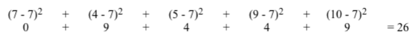
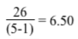
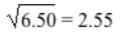

# Statistics

### Background: 
1. For this lab you will use numbers.txt which contains a large (N <= 1000) 
number of integers. The integers range in value from 0 to 100. The text file has been created with one value on each line. Due to the potential for the sum of the numbers to be very large, you should use a long integer in your calculation to find the average.
  
3. The number of integers in the file is unknown.
     
4. Your must write the following functions: average(), standardDeviation(), and mode().  The mode is defined as the value(s) present with the highest frequency. Calculating the standard deviation consists of the following steps:
  
	a. Find the average of the list of numbers. </li>
	b. Determine the difference of each number from the average, and square each 
difference. Sum all the differences. </li>
	c. Divide this sum by (the number of values - 1). </li>
	d. Take the square root of the above division result from step c. </li>

5. Example, given this list of numbers: 7 4 5 9 10
   
	a. The average = 7 </li>
	b. Sum of square of differences: 

   

	c. 
	d.  </li>

6. For a normal distribution, 68.3% of the data will lie within one standard deviation of the 
average, while 95.4% will lie within two standard deviations. 

### Assignment: 
1. Your program should print out the average, standard deviation, and mode of the data in numbers.txt.  

	Format the real numbers to print with 2 decimal places. 

2. Your program must utilize proper modular design and parameter passing. 

  
  
